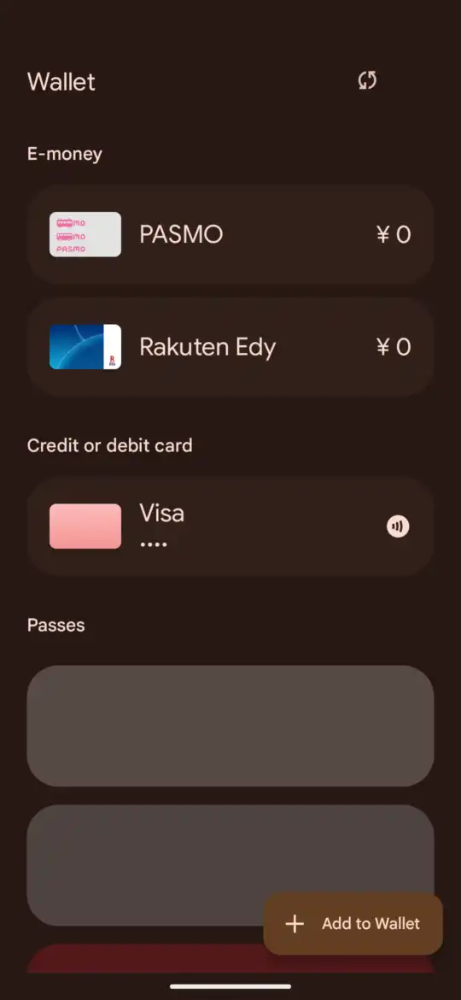
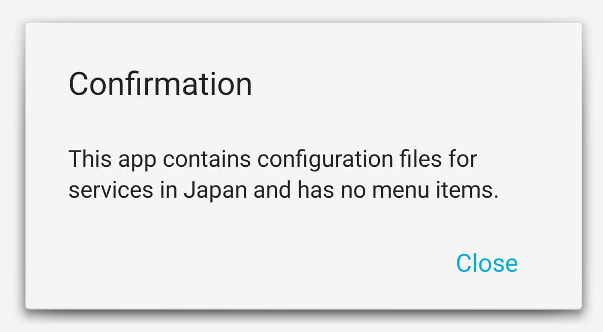

# Enabling Osaifu-Keitai feature on non-japanese Google Pixel smartphones

 
 

# Introduction

This doc describes the way that the Osaifu-Keitai feature is disabled on non-japanese Google Pixel SKUs and gives solutions on how to overcome this **artificial** limitation in order to enable it.

[Osaifu-Keitai (おサイフケータイ, Osaifu-Kētai), is the de facto standard mobile payment system in Japan. Osaifu-Keitai services include electronic money, identity card, loyalty card, fare collection of public transits (including railways, buses, and airplanes), or credit card.](https://en.wikipedia.org/wiki/Osaifu-Keitai)

# Eligibility and a root of the issue

Both Google Pixel 7 and 6 series devices have the required applet provisoned in the SE from the factory, although other models could be supported too. This can be checked in the following manner:

If you download the [Osaifu-Keitai](https://play.google.com/store/apps/details?id=com.felicanetworks.mfm.main) app `com.felicanetworks.mfm.main` and try opening it from a non-japanese model, you'll be presented with a following deceiving error message.

 

Upon apk decompilation and code inspection, we see that this app does following operations that lead to such an exception:

1. Upon start, app looks for a file at system path `/product/etc/felica/common.cfg`. If no file is found. App returns a following error message `This phone doesn't support Osaifu-Keitai function. Close this application`.  
In this case you're SOL and your device or firmware is not compatible anyway.

2. If such a file is found, app reads all entries/keys inside of it and saves them into a hash map. We are interested in following entries:   
   * 00000018
   * 00000015
   * 00000014

3. On UI initialization, application calls `isCheckInbound` method, which then does the following:  
a) If key 00000018 is available, it checks if its value is "1". If that's the case, app assumes that Osaifu-Keitai is enabled.   
b) Otherwise, it retreives [ContentProvider](https://developer.android.com/guide/topics/providers/content-providers) URL from key 00000014 and column index 00000015.

4. **This is the moment we are being screwed**. MSM app queries the provider, which in case of Google Pixel has a URL of `content://com.google.android.pixelnfc.provider.DeviceInfoContentProvider/isJapanSku`, which corresponds to `com.google.android.pixelnfc` application. Upon apk inspection we can see that **the ONLY purpose of this app is to return 0 for non-japanese SKUs, thus forbidding you from using this feature**. Inside the source code we see that this app retreives SKU from system build props and checks if it is in a whitelist using the `isDeviceJapanSku` method, returning 1 if it is and 0 otherwise.

5. Upon getting 0, MSM app returns the error code shown on the screenshot.

# Possible solutions

## Overcome the limitations without root.

Following methods have been unsuccessfuly attempted:

1. Manipulate `com.google.android.pixelnfc`:  
(FAIL) System apps are well-protected agaist manipulation.  
1.1. Let's uninstall this app:  
It is a system application and thus cannot be uninstalled.  
1.2. Install my own app with same provider URL:  
You cannot install a new application that declares a provider with conflicting URL untill you uninstall an old one.  
1.3. Decompile and patch the apk, adding your SKU to whitelist:  
Not possible as android requires app overwrites/updates to have the same signature.

2. Manipulate `com.felicanetworks.mfm.main`:  
(UNKNOWN) This might be possible to do without root, but I did not attempt to finish it to the end as it proved to be too complex lacking any experience with android development.  
Thing is, `com.felicanetworks.mfm.main` communicates with, `com.felicanetworks.mfc` (Mobile Felica client),  `com.felicanetworks.mfs` (Mobile Felica settings), `com.google.android.gms.pay.sidecar` (Google Play services for payments) which all do mutual signature verification, thus requiring you to patch ALL of those apps for them to work, replacing signatures and fixing API access due to signature changes.

As rootless solutions have led us to a dead end, we're gonna join the **dark side**.

## Solutions that require unlocking the bootloader and/or rooting.

> **Warning**
> Following solutins should ONLY be attempted if you know what you are doing as it is possible to PERMAMENTELY render your device unusable.

> **Warning**
> I take **NO RESPONSIBILITY** for your actions in case you go forward and fail.

> **Warning**
> It might seem simpler than it looks.  
**I've personally had bricked** (but thankfully recovered) my device when unrooting even though i've followed the tutorial step by step (cause Google Flashing Utility crashed during the process).  

> **Warning**
> **I won't** provide a detailed step-by-step guide to discoruage people lacking enough understanding from trying and breaking their devices.

Let's look at root-based solutions, some of which were tested and work:

1. It is possible to permamently modify the model ID (aka MID) of Google Pixel devices using custom recovery or Root+Magisk so that they pass the check.  
I did not try this method so i have nothing to say. In case you are interested, read [this forum topic at XDA](https://forum.xda-developers.com/t/converting-japanese-pixel-6-to-global-version.4365275/).  
The upside is that this solution is permament and does not require root (so no SafetyNet cat and mouse and you can get OTA).  
The downside is that you get shutter sound and that some cellular bands used in your region might be disabled for JP.
2. It is possible to create a Magisk module that replaces `/product/etc/felica/common.cfg` file with the one that links to your own provider or has the 00000018 key set to 1, thus making your device pass all checks.
3. Using root and magisk, you can fully [delete](https://github.com/sunilpaulmathew/De-Bloater) the original `com.google.android.pixelnfc` apk, and upload a patched one that returns successful check on every request. As MSM does not check its signature (cause as of now there is no way for it to do so) everything works from the get go.  
This is the way i've done it  (proof in the GIFs at the beginning of this page).

If you go with a 3) way you should know the following tips:
1. If you want to initialize Osaifu-Keitai with Google Wallet, you have to install [Universal SafetyNet Fix](https://github.com/Displax/safetynet-fix) in order to pass safetynet. For me it did the job from the get go.
2. To verify successful SafetyNet attestation, you can use the [YASNAC](https://play.google.com/store/apps/details?id=rikka.safetynetchecker). It should return PASS.
3. To delete a system app, you can use [De-Bloater](https://github.com/sunilpaulmathew/De-Bloater). Reboot the system after removing the patch.
4. To unpack and pack apk into modifyable (SMALI) form, use [apktool](https://ibotpeaches.github.io/Apktool/).
5. To verify that your SMALI modifications did not break the code, you can decompile the app using [jadx](https://github.com/skylot/jadx) and check that the modifyed code has no errors.
6. Some Osaifu-Keitai partner apps are geoblocked, I had to use multiple VPNs before it let me provision a some cards.
6. Some apps detect root by tring to invoke Magisk, hide it and add the problematic app into the denylist.
7. If you plan on unrooting, DO NOT lock the bootloader before verifying that an unrooted install is bootable. You can use recovery if direct factory image flashing does not work (for me it didn't).
8. When following tutorials, watch the tutorial FIRST before starting to follow it. Rewatch multiple times, and follow the video closely in order not to skip an important step.

# Notes

In order to enable japanese Google Wallet UI, you have to install `com.felicanetworks.mfc` and turn on japanese VPN. After a couple of minutes the wallet app should go into "Updating" state, in a couple of minutes after that it will start up with a new japanese UI.   

Be aware that for Osaifu-Keitai functionality to work with Google Wallet, you have to install all following applications:  
- `com.felicanetworks.mfm.main` 
- `com.felicanetworks.mfc` 
- `com.felicanetworks.mfs`  
- `com.google.android.gms.pay.sidecar`

If you unroot/reinstall the system after provisioning the services, they'll continue to be available because the Osaifu-Keitai applet (Unlike CarKey applet and etc) is not cleared upon system reset.
Related applications won't work, but you'll still be able to use the device as if it were a multiple-card combo.

# Other notes

- We can only guess why did Google decide to lock global users from this feature.  
The biggest probability thus far is licensing requirements, as it is possible that the service provider requires a fee for each device that this feature is enabled for.    
It is also possible that for the sake of economy of scale google manufactures and licenses all devices, but to simplify support they've locked out unused features from other regions.  
This doc has been published to shed light on this issue and try to give some pointers to the people that want to try and overcome this limitation.

- Android implementation is much worse in comparison to the one Apple has:
  - Google Wallet app wraps external apps instead of implementing all functionality on its own.
  - CRS?? applet on Android does not notify the operating system about events that happen with the SE, so there are no interaction animations, and balance has to be synchronized inisde apps manually by using the 'refresh' button instead of it being tracked by the OS in the background.
  - Provisioned "systems" share? same logical space, therefore having multiple services with overlapping service and system codes is not possible, user has to reconfigure 'move to/from mainland' on the applet each time he wants to enable one of the conflicting systems.

- During the tests i've found out that CarKey applet does not work on rooted system as it requires hardware-backed SafetyNet attestation before configuration, which cannot be achieved with root.  It is possible that google, other devs such as felicanetworks expand this harware-based check to more apps, thus making root-based bypass irreversibly unusable.
